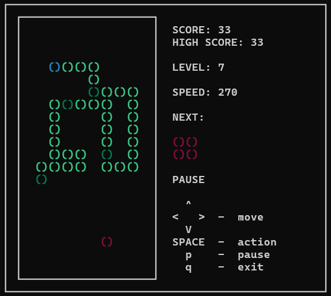
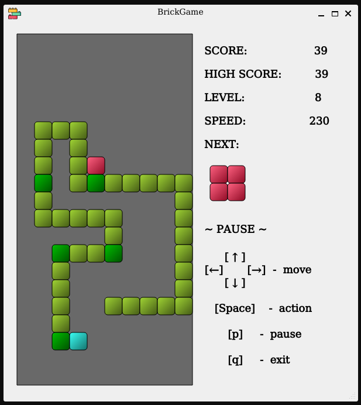

# BrickGame_v2.0.Snake
Implementation Snake game in the C++ programming language and Qt, based on MVC pattern and finite-state machine.

## Project description

  

  

The project consists of two separate components implementing the Snake game: a library responsible for the game logic and a desktop GUI.

Game library connected to the console interface of BrickGame v1.0.
The Tetris game developed in BrickGame v1.0 connected to the desktop interface developed in this project.  

### Controls:

Start game - `Enter`;

Pause - `p`;

End game - `q`;

Moving left - `Left arrow`;

Moving right - `Right arrow`;

Moving down - `Down arrow`;

Moving up - `Up arrow`;

Increase speed - `Space`.

## Building project

Program library code located in the `src/brick_game/` folder.
Program interface code located in the `src/gui/` folder.
Installation directory `src/install`.

Makefile targets: 

`all` - builds the project and launches the game;

`install` - builds the project and places in an installation directory;

`uninstall` - removes the installation directory;

`play` - launches the game;

`clean` - removes the object files;

`dvi` - creates documentation;

`dist` - creates distribution package;

`test` - runs tests;